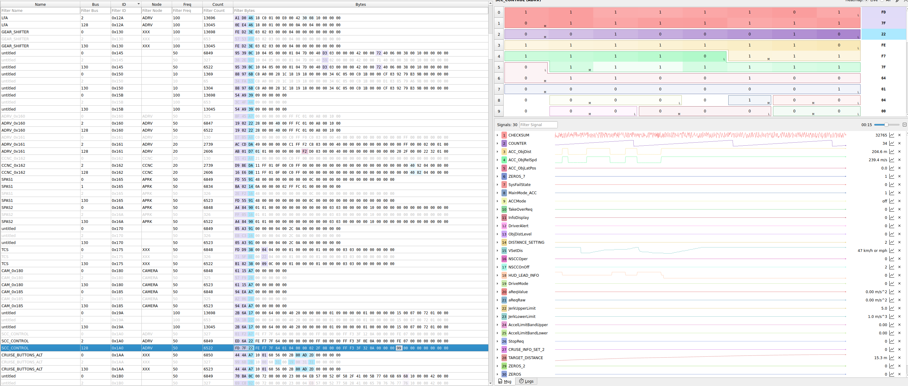
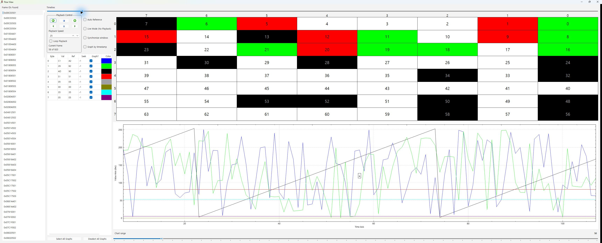

# Joongyu

**Automotive CAN reverse engineering · Embedded systems · Vehicle diagnostics**

I analyze vehicle communication and build the firmware and software around it.

[Telegram · @joongyu01](https://t.me/joongyu01)

### Reverse engineering

Automotive CAN/CAN FD frame and signal analysis, DBC investigation, and protocol behavior analysis. I use captured traffic, driving logs, and code to understand how vehicle systems communicate, with Cabana and SavvyCAN for signal inspection and bit-level analysis.

### Embedded systems

ESP32 / Arduino firmware, CAN monitoring, and multi-bus interfaces. My work connects hardware inputs, communication protocols, and software tools for data capture and system integration.

### Vehicle diagnostics

BLE OBD data acquisition, EV battery and powertrain telemetry, and diagnostic logging. I build tools and dashboards to collect, inspect, and visualize vehicle data.

I also work on frontend development, backend APIs, database design and integration, computer vision, data processing, and workflow automation.

Some reverse-engineering work and technical details remain private for security and confidentiality.

### Analysis workspace

**Cabana — CAN FD frame inspection & signal analysis**

**SavvyCAN — Bit-level inspection & byte analysis**

---

### 한국어

**자동차 CAN 리버스 엔지니어링 · 임베디드 시스템 · 차량 진단**

차량 통신을 분석하고, 이를 활용하는 펌웨어와 소프트웨어를 만듭니다.

**리버스 엔지니어링**

자동차 CAN/CAN FD 프레임·신호 분석, DBC 조사, 프로토콜 동작 분석을 다룹니다. 수집한 통신 데이터와 주행 로그, 코드를 함께 살펴 시스템 간 통신 구조를 파악하며, Cabana와 SavvyCAN으로 신호와 비트 단위 변화를 분석합니다.

**임베디드 시스템**

ESP32·Arduino 기반 펌웨어, CAN 모니터링, 다중 버스 인터페이스를 개발합니다. 하드웨어 입력과 통신 프로토콜을 소프트웨어 도구에 연결해 데이터를 수집하고 시스템을 연동합니다.

**차량 진단**

BLE OBD 데이터 수집, 전기차 배터리·파워트레인 상태 모니터링, 진단 로깅을 다룹니다. 차량 데이터를 수집·분석·시각화하는 도구와 대시보드를 만듭니다.

이외에도 프론트엔드 개발, 백엔드 API, DB 설계·연동, 컴퓨터 비전, 데이터 처리, 업무 자동화를 합니다.

일부 리버스 엔지니어링 작업과 기술 세부 사항은 보안과 기밀 유지를 위해 비공개로 관리합니다.

[Telegram · @joongyu01](https://t.me/joongyu01)
